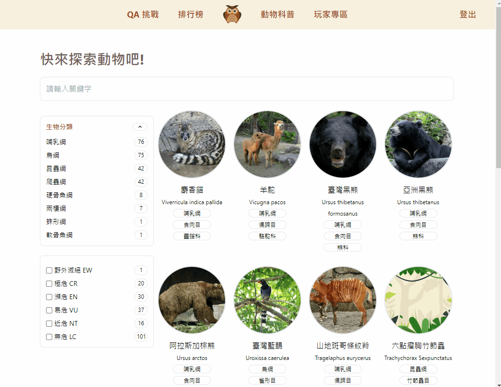

# Animal Quiz

A Multiplayer Animal Quiz Game with Animal Introduction

<https://animal-quiz-4be2f.web.app/>

## Table of Contents

- [Features](#features)
  - [Quiz Game](#quiz-game)
    - Game Modes
    - Question Types
  - [Animal Introduction](#animal-introduction)
    - Instantly Filter and Search
    - Infinite Scroll
    - Zhuyin (注音, Mandarin Phonetic Symbols)
  - [Other Features](#other-features)
- [Tech](#tech)
  - TypeScript
  - React
  - Redux
  - [Reselect](#reselect)
  - [Algolia](#algolia)
  - Tailwind
  - Framer Motion
  - Firebase:
    Authentication, Firestore, Storage, Hosting
- [Flow Charts](#flow-charts)

---

## Features

### Quiz Game

- Questions generated randomly.
- 3 game modes

  - Normal

    - 10 questions
    - no time limit

  - Time challenge
    - no question limit
    - 30 seconds
  - Competition

    - no question limit
    - 30 seconds
    - Allows user to invite others into the room and compete against each other in real time.

- 3 question types

  - single
  - multiple
  - true-false


### Animal introduction

- Instant search and filter

  - achieve by [Algolia](#algolia)



- Infinite scroll
  - use observer


- Zhuyin (注音, Mandarin Phonetic Symbols)
  - use BpmfGenSekiGothic font from [ButTaiwan/bpmfvs](https://github.com/ButTaiwan/bpmfvs)


### Other Features

- When the guest logs in after playing several games, all previous records will be kept to the history of the new login user.

- Leaderboard
  - Keeps track of ranking results of different modes and displays on leaderboard.


- USerPage
  - Records previous quiz game result.


---

## Tech

### Reselect

- In order to reduce unnecessary render and improve performance, Reselect was used with Redux to solve it.

```TypeScript
const selector = createStructuredSelector({
  options: (state) => state.quiz.question.options,
  questionId: (stat) => state.quiz.question.id,
});
function QuestionBox() {
  const { options, questionId } = useAppSelector(selector);
  return (
    ...
  );
}
```

```TypeScript
const selector = createSelector(
  (state) => state.quiz.mode,
  (state) => state.quiz.qIdList,
  ( mode, qIdList) => ({
    mode,
    hasNextQuestion: mode !== 'normal' || qIdList.length < 10,
  }),
);

function QuestionBox() {
  const { mode, hasNextQuestion } = useAppSelector(selector);
  return (
      ...
  );
}
```

### Algolia

- Algolia provides search as a service, offering web search across a client's website using an externally hosted search engine.
- <https://www.algolia.com/products/search-and-discovery/hosted-search-api/>

### Framer Motion

- A animation package.
- <https://www.framer.com/motion/>

---

## Flow Charts

- Quiz Game Flow Chart


- Animal Information Flow Chart


