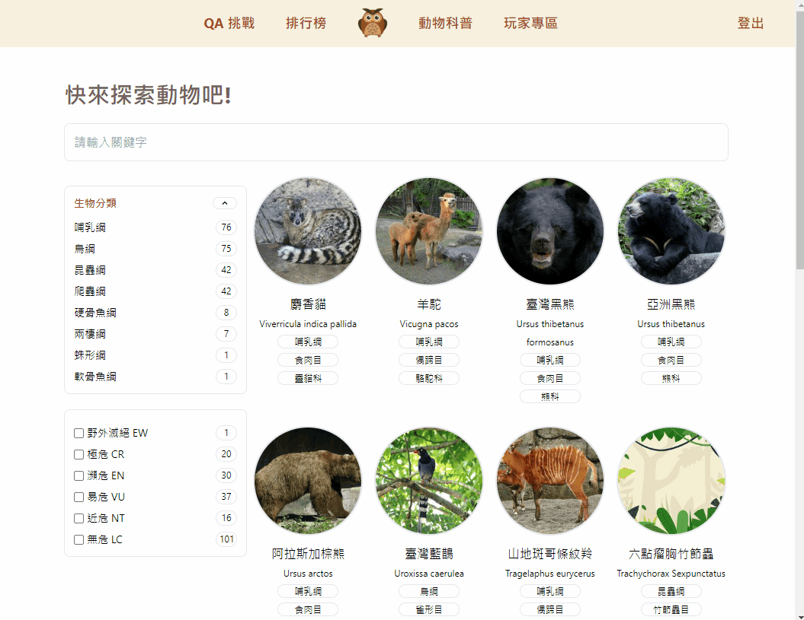

# Taipei Zoo Explorer

An educative website introducing various zoo animals with a multi-mode quiz game.

Visit <https://taipei-zoo-explorer.web.app/>

## Table of Contents

- [Features](#features)

  - [Animal Exploring Page](#animal-exploring)

    - Collecting 250+ animal data that originated from Taipei Zoo open data.
    - Powered by Algolia API, users can instantly search for animals on every keystroke and seamlessly scroll through search results.
    - Zhuyin (Mandarin Phonetic Symbols, 注音) is available for children to read easily.

  - [Quiz Game](#quiz-game)

    - There’re 3 game modes: normal, time challenge and competition mode, along with 300+ animal questions and the leaderboard feature.
    - In competition mode, users can invite others into the room and compete against each other in real time.
    - All game records are kept in the database, so the logged-in users can view their previous records in game history.

  - [Other Features](#other-features)

- [Tech](#tech)
  - TypeScript
  - React
  - Redux
  - [Reselect](#reselect)
  - [Algolia](#algolia)
  - Tailwind CSS
  - [Framer Motion](#framer-motion)
  - Firebase:
    Authentication, Firestore, Storage, Hosting
- [Flow Charts](#flow-charts)

---

## Features

### Animal Exploring

- Instant search and filter

  - achieve by [Algolia](#algolia)

- Infinite scroll
  - use Intersection Observer API

- Zhuyin (注音, Mandarin Phonetic Symbols)
  - use BpmfGenSekiGothic font from [ButTaiwan/bpmfvs](https://github.com/ButTaiwan/bpmfvs)

### Quiz Game

- Questions generated randomly.
- 3 game modes

  - Normal

    - 10 questions
    - no time limit

  - Time challenge
    - no question limit
    - 30 seconds
  - Competition

    - no question limit
    - 30 seconds
    - Allows user to invite others into the room and compete against each other in real time.

- 3 question types

  - single
  - multiple
  - true-false

### Other Features

- When the guest logs in after playing several games, all previous records will be kept to the history of the new login user.

- Leaderboard
  - Keeps track of ranking results of different modes and displays on leaderboard.

- USerPage
  - Records previous quiz game result.

---

## Tech

### Reselect

- In order to reduce unnecessary render and improve performance, Reselect was used with Redux to solve it.

### Algolia

- <https://www.algolia.com/products/search-and-discovery/hosted-search-api/>
- Algolia provides search as a service, offering web search across a client's website using an externally hosted search engine.
- Algolia is used in [multiple packages' document page](https://docsearch.algolia.com/) like React, Redux, TypeScript, Tailwind CSS, Bootstrap, Material UI, GraphQL.

### Framer Motion

- A animation package.
- <https://www.framer.com/motion/>

---

## Flow Charts

- Quiz Game Flow Chart

- Animal Information Flow Chart

